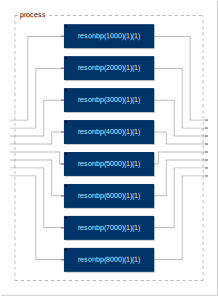

# faust_jp \#1

Matsuura Tomoya/松浦知也

<https://matsuuratomoya.com>

---

# 自己紹介

- 松浦 知也
- 九州大学 大学院芸術工学府
- サウンドアート制作とか、演奏したりとか、プログラミングしたりとか

---

# 本日の流れ

- Faustについての簡単な概要紹介
- 各環境の軽いデモ
- 文法の説明
- コンパイラ周りの説明（アーキテクチャ、faust2xxx）
- 皆でハンズオン

---

# What's FAUST?

---


**FAUST** = **F**unctional-**AU**dio-**ST**ream

---

## FAUST

- 音声信号処理のための関数型プログラミング言語
- フランスのGrameという研究所が2002年頃から開発、ライブラリではスタンフォード大学CCRMAなども協力
- コンパイラは、FAUST言語からC, C++, JAVA, JavaScript, ASM.js, LLVM ビットコードを出力する

--

- “アーキテクチャファイル”と様々なスクリプトで多フォーマットに変換
- Max/Pdオブジェクト、スパコUGen、VST/AUプラグイン等
- コンパイラはGPLライセンス・クロスプラットフォーム
- 但しコンパイラで出力したコードはFAUSTソースのライセンスに従うので自由に決められる
- 標準ライブラリもGPLだが普通に使うだけならライセンス自由

--

<!-- .element style="max-width:70%;" -->

---

## 一番近いもの：Gen

- 全てがサンプル単位（メッセージとの区別なし）
- リアルタイムにC++に変換

---

## FAUSTのココがいい

* 一つのコードを様々な環境に再利用できる
* リバーブなどの複雑なシグナルパスを持つものもMaxなどに比べ簡潔に書ける
* ライブラリの全てがFAUSTだけで記述されている
* C++直書きするよりも高速（その分読めないが）

---

## FAUSTのココがダメ

* 文法が特殊すぎる（但しコツを掴めばそこからは早い）
* エラーメッセージが何を指してるのか全くわからない
* 全てがシグナルレートなのでモノによってはリソースの無駄遣い
* サンプラー、グラニュラーなどwav読み込み系✕
* FFT、高速畳み込み系✕

---

# ユースケース

--

## Guitarix

<http://guitarix.org/>

- Linux向けギターアンプシミュレーター
- コアコードはFaustの標準ライブラリに付属！

--

## Radium

<http://users.notam02.no/~kjetism/radium/>

- いわゆるTracker系のシーケンサ
- コンパイラ内蔵(!)で直接faustコードをエフェクトとして使用可
- ただMac版はめちゃくちゃ不安定

--

## pMix2

<https://github.com/olilarkin/pMix2>

- VSTプラグイン上で更にVSTやfaustコードをルーティングできる
- しかもパラメータを自由にマップしてまとめてオートメーション
- これのために[JUCE用faustモジュール](https://github.com/olilarkin/juce_faustllvm)を開発している

--

## OWL

<https://hoxtonowl.com/>

- プログラマブルなギターペダルorユーロラックモジュール
- faust2owlスクリプト一発で出力可能!

--

## Bela

<http://bela.io/>

- Beaglebone Black用Capeと専用カスタムOS
- バッファサイズを2まで落とせる低レイテンシー
- faust2belaのスクリプトが古い？が手動でも簡単に設定可

---

# 開発環境

* コンパイラ
* FaustLive
* faustgen~ on Cycling’74 Max
* オンラインコンパイラ
* Faust Playground(beta)
* Faust WebAssembly コンパイラ(beta)
* ~~FaustWorks~~（開発終了）

--

||Auto Compile|External source|GUI|Audio|binary export|editor|
|:---:|:---:|:---:|:---:|:---:|:---:|:---:|
|Compiler|✕|◯|✕|✕|◎(local)|✕|
|FaustLive|◎(Watch)|◯|◯|◯|◯(online)|✕|
|faustgen~|◯|△|✕|◯|✕|△|
|Online Compiler|✕|✕|✕|✕|◯|◯|
|Faust Playground|◯|✕|◯|◯|◯|◯|
|Wasm Compiler|△|✕|◯|◯|◯|✕|

---

# 何はともあれ、<br>動かしてみよう

順番にデモします

---

## コンパイラ

以下のコードを書いて.dspというファイルを作る

```java
//first.dsp
process=_;
```

--

コマンドラインで以下の用に打つ

```bash
cd (ファイルのあるディレクトリ)
faust first.dsp
```

--

ぶわーっとこんな感じのが出てくる

```cpp
//name: "first"
//Code generated with Faust 2.1.0 (http://faust.grame.fr)


#ifndef  __mydsp_H__
#define  __mydsp_H__

#ifndef FAUSTFLOAT
#define FAUSTFLOAT float
#endif


#ifndef FAUSTCLASS
#define FAUSTCLASS mydsp
#endif

class mydsp : public dsp {

 private:

	int fSamplingFreq;

 public:

	void metadata(Meta* m) {
		m->declare("name", "first");
	}

	virtual int getNumInputs() {
		return 1;

	}
	virtual int getNumOutputs() {
		return 1;

	}
	virtual int getInputRate(int channel) {
		int rate;
		switch (channel) {
			case 0: {
				rate = 1;
				break;
			}
			default: {
				rate = -1;
				break;
			}

		}
		return rate;

	}
	virtual int getOutputRate(int channel) {
		int rate;
		switch (channel) {
			case 0: {
				rate = 1;
				break;
			}
			default: {
				rate = -1;
				break;
			}

		}
		return rate;

	}

	static void classInit(int samplingFreq) {

	}

	virtual void instanceConstants(int samplingFreq) {
		fSamplingFreq = samplingFreq;

	}

	virtual void instanceResetUserInterface() {

	}

	virtual void instanceClear() {

	}

	virtual void init(int samplingFreq) {
		classInit(samplingFreq);
		instanceInit(samplingFreq);
	}
	virtual void instanceInit(int samplingFreq) {
		instanceConstants(samplingFreq);
		instanceResetUserInterface();
		instanceClear();
	}

	virtual mydsp* clone() {
		return new mydsp();
	}

	virtual int getSampleRate() {
		return fSamplingFreq;
	}

	virtual void buildUserInterface(UI* ui_interface) {
		ui_interface->openVerticalBox("first");
		ui_interface->closeBox();

	}

	virtual void compute(int count, FAUSTFLOAT** inputs, FAUSTFLOAT** outputs) {
		FAUSTFLOAT* input0 = inputs[0];
		FAUSTFLOAT* output0 = outputs[0];
		for (int i = 0; (i < count); i = (i + 1)) {
			output0[i] = FAUSTFLOAT(float(input0[i]));

		}

	}


};


#endif

```

--

### 保存

```bash
faust first.dsp -o first.cpp
```

--

### 画像出力

```bash
#必ずソースファイルと同ディレクトリで実行
faust2svg first.dsp 
```

--

fisrt-svgというフォルダの中にprocess.svgというのが現れる


--

ソースファイルを以下のようにして、もう一度

```java
//second.dsp
import("stdfaust.lib");
process=fi.lowpass(1,100);
```

```bash
faust2svg second.dsp 
```

--


ブラウザで開くと、ネストされた部分をクリックで掘っていける

--

### バージョンの話

- **faust0(masterブランチ)** C++のみ
- **faust2(faust2ブランチ)** LLVMでいろんなコードに/libfaust使える
- 基本的に最近使ってるのはfaust2だが、ライブラリなどの開発はmaster-devブランチでやってたりする

--

### インストール

バイナリ配布無し！！

```bash
git clone git@github.com:grame-cncm/faust.git
cd faust && git checkout faust2
make
sudo make install
```

**依存：llvm,openssl,(libmicrohttp)**

結構パスを通すのがつらい

--

### homebrew作りました

```
brew tap tomoyanonymous/faust&&brew install faust
```

llvmのビルドに1時間以上掛かるので注意

---

## FaustLive

とりあえず起動してCmd+Nで新規Window


--

こんな画面が出るので、dspファイルをドラッグドロップ


--

デモ動かしてみましょう

```java
//third.dsp
import("stdfaust.lib");
process = dm.virtual_analog_oscillator_demo;
```

--

※いきなり音出ます


--

Cmd+G押すとブラウザがSVG開きます


--

Cmd+KをするとQRコードとURLが出てくる


--

出てきたURLにアクセス<br>（同じネットワーク内ならスマホでもOK）


--

- これは、音自体はFaustLiveから出ている
- GUIのコントロールをブラウザからFaustLiveのアプリに向けてHTTPリクエストを飛ばして実現している
- MIDIもポートが勝手に立ち上がっているので、MIDIコン繋げばコントロール出来る（ソースコード側で対応していれば）
- OSCも同上

--

- ソースコードを改変→上書き保存してみよう
- 自動で更新、音はクロスフェード掛けてくれる

--

### エクスポート

- Cmd+Pでバイナリエクスポートのメニューが出る
- grameのサーバーにソース送ってコンパイル、バイナリをzipで送り返してくれる（Faustweb）


--

- よく脈絡なくクラッシュするが気にしない
- 変なファイルを読ませてしまって起動しなくなったらユーザーフォルダ直下の`.FaustLive-CurrentSession-2.0`というフォルダを丸ごと削除（勝手に復活します）
- それでもダメなら再インストールでだいたい解決

---

## faustgen~

Maxのウィンドウ上で、faustgen~オブジェクトを作る


--


--

- 何故かSVGブラウザがSafari固定
- Max標準のエディタだとかなり開発しづらいので外部エディタ推奨
- FaustコードはMaxパッチの中にまるまる保存されるので、依存ファイルが無ければパッチ単体だけコピーすればよし
- Maxに慣れているなら、プロトタイピングのスピードはこれが一番(私見)
- 但し、時々Maxを巻き込んでクラッシュ・・・

---

## オンラインコンパイラ

<http://faust.grame.fr/onlinecompiler>


--

- 基本はFaustLiveと同じ
- 但し音は出ない
- コンパイルは全てサーバーサイド
- 適当なサンプルコードをコピペして、バイナリにしてDLするには便利

---

## Faust Playground

<http://faust.grame.fr/faustplayground/>


--

- Webaudioで、ブラウザから音が出る
- Faustコードで出来たブロックを更にパッチングできる
- まだまだ開発途中なので不安定

---

## Faust WebAssembly Compiler

<http://faust.grame.fr/modules/faustlive-wasm.html>

GoogleChromeのみ

--

- 2017年8月に出たばっかり
- シングルファイルのみのコンパイル
- WebAssemblyなのでブラウザ上にしてはコンパイル時間が早い(らしい)

---

## Pythonラッパー

<https://github.com/marcecj/faust_python>

C経由でNumPyとセットで使うらしい（未使用）

---

# 文法解説

---

## 全てが関数

* FAUSTの世界では、ほぼ全てがインプットかアウトプット、または両方を持つ関数
* 複数のブロックを繋げたり並列したりして、大きなブロックを作るイメージ
* 最後に`process`というブロックを定義してやると完成

---

## 基本のキ:passとcut

```java
process = _,!;//アンダーバーはpass、！はcut
```


これも、1in1outと1in0outという入出力のブロック

---

## コンポジション(接続)記法

* FAUSTの最も特徴的な記法
* 最低限、プリミティブとコンポジションを覚えるとプログラムが書ける
* それぞれ入出力の規則があって、破るとコンパイルエラー

|並列|直列|分岐|結合|再帰|
|:---:|:---:|:---:|:---:|:---:|:---:|
|`,`|`:`|`<:`|`:>`|`~`|

--

### A,B →並列

```java
process = 10 , * ; 
```


制限：**無し**

**0in1out**と**2in1out**が組み合わさって**2in2out**になった

--

### A:B →直列

```java
process = ( * , / ) : + ; 
```


制限：**Aの出力数==Bの入力数**

--

### A<:B →分岐

```java
process = (10,20)<:(+,*,/);
```


制限：**Aの出力数×n ==Bの入力数(n=2,3,4,,,)**

--

### A:>B →結合

```java
process = (10,20,30,40):>*;
```

<!-- .element style="width:300px;"-->

制限:**Aの出力数==Bの入力数×n(n=2,3,4,,,)**

--

### A~B →再帰

```java
process = +(12345) ~ *(1103515245);
```


制限:**Aの_入力_数≧Bの_出力_数_かつ_Bの_入力_数≧Aの_出力_数**

ここではA,Bともに1in1outなので満たしている

---

### 接続の優先順位

**再帰>並列>直列>分岐＝結合**

```java
//以下2つは同じ(ソースコードの読みやすさを優先しましょう)
process = (((_,0.5):*)<: (*,*) :> _) ~ _;
process = (_,0.5 : * <: *,* :>_ ) ~ _;
```


---

## 頭の体操


どうやって作る？

--

## ヒント


--

## 正解

```java
process = (_,_)<:(!,_,_,!)//ライブラリにあるro.cross(2)で実現化
```

だいたいライブラリでどうにかなるが、<br>考え方として覚えておくと便利

---

## 反復

- いわゆるforループ的機能
- 実は`par`以外あんまり使わない

```java
//1000,2000,3000,,,とバンドパスフィルタを8つ並列
import("stdfaust.lib");
process = par(i,8,fi.resonbp((i+1)*1000,1,1));
```

|並列|直列|総和|総乗|
|:---:|:---:|:---:|:---:|
|`par`|`seq`|`sum`|`prod`|

--



---

## (引数付きの)関数

- 同じ機能のパラメータ（定数）違いを作る時に便利
- しかしなんと、**_引数なしでも使える!!!_**
- FAUSTの中で2番目くらいにややこしい所

<small>ここからは"関数"と呼ぶ場合は基本的には引数付き関数を指すことにします</small>

--

これはまだいい

```java
//ゲインを掛けた後、DCオフセットを加える関数
gain_offset(gain,offset) = _:*(gain):+(offset);
process = gain_offset(0.5,-0.3);
```


--

引数無しで使う

```java
gain_offset(gain,offset) = _:*(gain):+(offset);
process = gain_offset;
```


**引数がインプットとして追加される**

--

一部だけ引数を入れる

```java
gain_offset(gain,offset) = _:*(gain):+(offset);
process = gain_offset(0.5);
```


足りない引数がインプットとして追加される

--

### 小技：引数の最後をinputにする

```java
import("stdfaust.lib");
comp(gain,input) = input*(1 - gain* (input:abs:fi.lowpass(1,10)));
process = comp(1); //引数を最後のinputは代入しない
```


コンプレッサーのような、インプットを離れた場所で使う時に便利

---

## ローカル変数:with{}

```java
gain_offset(gain,offset) = _*gain+offset+initial_offset
	with{
			initial_offset = -0.5
	};
```

※セミコロンはwithの中カッコの**後**

---

## その他

- パターンマッチング+再帰関数がFaustの真髄
- 上手く使うとparでもseqでも書けない物が書ける
- ですが難しいので今回は省略
- [ここ](https://matsuuratomoya.com/blog/2017-01-07/faust_grammer/)の後半で解説しています

---

## ライブラリ関連

ソースを整理していくための機能

- `environment{}`
- `library()`
- `component()`
- `import()`

--

### environment

Cのstructとか、jsのオブジェクトに近い

```java 
params = environment{
    gain = 0.5;
    offset = -0.3;
}
gain_offset(gain,offset) = _:*(gain):+(offset);
process = gain_offset(params.gain,params.offset);//ドットでアクセス
```

--

### library()

- ライブラリを`myfunc.lib`のように.libファイルに作っておける
- ライブラリに`process=`は入れない

```java
//in myfunc.lib
gain_offset(gain,offset) = _:*(gain):+(offset);
//in mydsp.dsp
mylib = library("myfunc.lib");
process=mylib.gain_offset(0.5,-0.3)
```

--

### component()

- .dspファイルを直接呼び出す

```java
//in gainoffset.dsp
process = _:*(0.5):+(-0.3);
//in mydsp.dsp
mygainoff = component("gainoffset.dsp");
//実はlibrary("gainoffset.dsp").processでもOK
process=mygainoff; //引数は使えないので注意
```

-- 

### import()

ライブラリの名前空間をそのまま展開

```java
//in myfunc.lib
gain_offset(gain,offset) = _:*(gain):+(offset);
//in mydsp.dsp
import("myfunc.lib");
process=gain_offset(0.5,-0.3)
```

---

## 標準ライブラリ

<http://faust.grame.fr/library.html>

`import("stdfaust.lib");`しておけば全ての標準ライブラリが使える

--

## stdfaust.libの中身

```java
//################################ stdfaust.lib ##########################################
// The purpose of this library is to give access to all the Faust standard libraries
// through a series of environment.
//########################################################################################

an = library("analyzers.lib");
ba = library("basics.lib");
co = library("compressors.lib");
de = library("delays.lib");
dm = library("demos.lib");
dx = library("dx7.lib");
en = library("envelopes.lib");
fi = library("filters.lib");
ho = library("hoa.lib");
ma = library("maths.lib");
ef = library("misceffects.lib");
os = library("oscillators.lib");
no = library("noises.lib");
pf = library("phaflangers.lib");
pm = library("physmodels.lib");
re = library("reverbs.lib");
ro = library("routes.lib");
sp = library("spats.lib");
si = library("signals.lib");
sy = library("synths.lib");
ve = library("vaeffects.lib");
sf = library("all.lib");

```

--

- 標準ライブラリはフィルターやオシレーターなどが超充実してるのでガンガン使いましょう
- signal.lib、route.lib、basic.lib辺りはとりあえず眺めておいて損はない

---

## プリミティブ

- 演算子系(数学、ビット演算)
- 数学関数（Cのmath.h/Max,Pdのexpr）
- ディレイ、シグナルセレクター
- ウェーブフォーム
- **UI**

--

### 演算子系

- `int`(キャスト),`+`,`-`,`*`,`/`,`^`(pow),`%`
- `&`,`|`,`xor`,`<<`,`>>`,`<`,`<=`,`>`,`>=`,`==`,`!=`

- int以外は1+2のような演算子記法もOK(優先順位はコンポジションより低い)、1:+(2),(1,2):+のような使い方もOK
- \>などは分岐、結合と記号が被るのでカッコで囲まないと上手く行かないことが多い

--

## 数学関数

- `cos`,`sin`,`tan`,`acos`,`asin`,`atan`,**`atan2`**
- `exp`,**`log`**,`log10`,**`pow`**
- `sqrt`,`abs`,
- **`min`**,**`max`**,**`fmod`**,**`remainder`**,`floor`,`ceil`,`rint`

太字のものは、2引数(インプット)

--

## ディレイ・シグナルセレクター

- `mem`/`prefix`/シングルクオート→1サンプルディレイ
- `@(n)` → nサンプルディレイ
- `rdtable(size,initdata,rdindex)`→固定テーブル
- `rwtable(size,initdata,wtdata,wtindex,rdindex)`→読み書きテーブル
- `select2(sel,st0,st1)`,`select3(sel,st0,st1,st2)`<br>→シグナルセレクター（selが0,1,それ以上で判別、select2で1以上だと0を出力、また0以下はエラー）

---

## UI

- Faustのソース内でUIを定義できる
- ボタン、トグル、縦横スライダー、数値入力、<br>シグナルメーター、グルーピング
- その他拡張メタデータも可能
- **但し実装は出力する環境次第**
- 例えばQtならスライダーをノブに出来たり、MIDI入力の定義ができるが、Max/Pdでは全部メッセージ入力で統一（メーターは実装なし）

--

### button

`button("label")`


押している間のみ1を出力、それ以外は0

--

### checkbox

`checkbox(label)`


クリックで0/1を切り替え

--

### slider,nentry

`hslider("label",default,min,max,step)`

`vslider("label",default,min,max,step)`

`nentry("label",default,min,max,step)`

--

### bargraph

`hbargraph("label",min,max)`

`vbargraph("label",min,max)`

出力先が無いと自動的に削除されてしまうため、それを回避するための関数
`attach(x,vumeter(x))`というのを使う事が多い

--

### Group

`hgroup("name",exp),vgroup("name",exp),tgroup("name",exp)`

```java
gr = hgroup("Foo",
        vgroup("Faa",
            hslider("volume" ,def,min,max,step)
        ... 
    )
    ...
);
```

ただ、Faustの記法としては異質なので<br>もう一つのほうがよく使う

--

### Group(Pathname)

```java
hs = hslider("/h:Foo/v:Faa/t:tabu/volume",def,min,max,step);
```

定義場所が全然別の場所でもOK

--

### metadata

ラベルに[]でメタデータが埋められる。メタデータに沿った実装がされてれば有効になる

```java
knob = hslider("volume[style:knob][unit:dB][tooltip:this is volume]",def,min,max,step);
```

代表的なのは[style:knob]や表示単位[unit:Hz]とかMIDI実装の[cc:(割り当てたいCCナンバー)]とか

---

# コンパイラ関係

---

## アーキテクチャファイル

```java
faust -a vst.cpp first.dsp
```

-aオプションで指定可能(大概は標準で付属しているのを使うが、自分で書いたのも当然使える)

--

- faustをコンパイルすると`mydsp`というクラスが出て来る
- 中でも重要なのは`compute()`と`buildUserInterface()`
- `compute()`には実際の信号処理内容、`buildUserInterface()`にはどのUIを組み立てるかが記述される
- C++コードからmydspをインスタンス化し、どこかでcompute()を呼び出す
- また、buildUserInterface()の中で`addButton()`などが呼び出されるので実際の処理内容を予め書いておく

--

…というのをアーキテクチャに書いておくと、コンパイラが一つのコードにまとめて出力してくれる

→後はC++のコンパイラを実行すればいいだけ!

※但し依存ファイルの配置がきちんとされていれば

---

### faust2xxx

でも、どうせならfaustのコードからいきなりバイナリまで行って欲しい

→処理をまとめたシェルスクリプトを書いておこう

--

付属しているやつ

```bash
faust2alqt               faust2dssi               faust2jackinternal       faust2msp64              faust2rosgtk             faust2w32max6
faust2alsa               faust2dummy              faust2jackserver         faust2netjackconsole     faust2rpialsaconsole     faust2w32msp
faust2alsaconsole        faust2eps                faust2jaqt               faust2netjackqt          faust2rpinetjackconsole  faust2w32puredata
faust2android            faust2faustvst           faust2juce               faust2octave             faust2sc                 faust2w32vst
faust2api                faust2firefox            faust2ladspa             faust2owl                faust2sig                faust2wasm
faust2asmjs              faust2gen                faust2lv2                faust2paqt               faust2sigviewer          faust2webaudio
faust2atomsnippets       faust2graph              faust2lv2synth           faust2pdf                faust2smartkeyb          faust2webaudioasm
faust2au                 faust2graphviewer        faust2mathdoc            faust2plot               faust2supercollider      faust2webaudiowasm
faust2bela               faust2ios                faust2mathviewer         faust2png                faust2svg                faust2webaudiowast
faust2caqt               faust2iosKeyboard        faust2max6               faust2puredata           faust2unity
faust2caqtios            faust2jack               faust2md                 faust2raqt               faust2vst
faust2csound             faust2jackconsole        faust2msp                faust2ros                faust2vsti
```

note:
何個かデモする。faust2juceとfaust2webaudiowasm

--

- QtならQtの、VSTならVSTのSDKが正しい位置に配置されてないと普通にエラー（どこに配置すべきかはスクリプト読まないとだめな場合が多い）
- FaustLiveやオンラインコンパイラーはgrame側のサーバーで全部やってくれるのでこの辺を考えなくていいので気楽

---

## コンパイルオプション

--

### 使うかも

- -e faustコードをプリミティブだけに展開して出力
- -a アーキテクチャファイルの指定
- -mdoc dspファイルのコメント中にtexでドキュメントを書いた物を出力する

--

### 演算精度

- -single:32bit（標準）
- -double:64bit
- -quad:128bit

--

### 並列化

* -scal 並列化なし（標準）
* -vec  並列化あり
* -vs <n> 	並列化した時のforループのバッファサイズ (default 32 samples)
* -lv <n> 	--loop-variant [0:fastest (default), 1:simple]
* -omp    	--openMPコード出力
* -pl     	--par-loop 

--

### 実験機能

- -ocl openCL
- -cuda CUDA

---

# とりあえず作る

--

[まずサイン波を作る](http://faust.grame.fr/examples/2015/09/30/oscillator.html)

リンクのやり方とはちょっと違うがほとんど同じ

--

- 方針:0~2piのノコギリ波を作り、sin/cosに入力
- まず、ノコギリ波を作ろう

--

## 1サンプルに1増える


```java
process = +(1)~_;
```

<small>※音出したらめちゃくちゃに割れるのでオンラインコンパイラなどで試すほうがいいかも</small>

--

## 1000を超えたらリセット


```java
process = +(1)~%(1000);
```

--

## 周波数を決めよう

```java
import("stdfaust.lib");
freq = hslider("freq",440,1,20000,0.01);
periodinsamps = int(ma.SR/freq); //ma.SRはサンプリングレートを呼び出してくれる

process = +(1) ~ %(periodinsamps);
```

--


--

## 範囲を0~2piにして、関数にしよう

```java
import("stdfaust.lib");
freq = hslider("freq",440,1,20000,0.01);
periodinsamps(f) = int(ma.SR/f);
saw(f) = (+(1) ~ %(periodinsamps(f)) ) : /(periodinsamps(f)) : *(2*ma.PI);

process = saw(freq);
```

--


--

## 完成

```java
import("stdfaust.lib");
freq = hslider("freq",440,1,20000,0.01);
periodinsamps(f) = int(ma.SR/f);
saw(f) = (+(1) ~ %(periodinsamps(f)) ) : /(periodinsamps(f)) : *(2*ma.PI);

process = saw(freq):cos;
```

音を出してみよう

--

ちなみに、ライブラリにサイン波だけでも死ぬほど揃ってます

```java
import("stdfaust.lib");
//テーブルベース
os.oscsin(freq)
os.hs_oscsin(freq,c)
os.oscp(freq,p)
os.osci(freq)
//フィルタベース
os.oscb(freq)
os.oscrq(freq)
os.oscrs(freq)
os.oscs(freq)
//ウェーブガイドベース
oscw(freq)
```

---

## ライブラリを活用してみよう

```java
import("stdfaust.lib");
//8*8matrix reverb
primes = 1,2,3,5,7,11,13,17;
dtime = hslider("delaytime[unit:ms]",20,10,200,0.001)*ma.SR/1000;
delay_bus = par(i,8,de.fdelay(2*ma.SR,dtime+ba.take(i+1,primes)));

fbgain = hslider("feedback_gain[unit:dB]",-7,-70,-6,0.01):ba.db2linear;
gain_bus = par(i,8,*(fbgain));

matrix = ro.hadamard(8):par(i,8,/(sqrt(2)));
merge=si.bus(8):>si.bus(2):(/(4),/(4));

process = (si.bus(2) <: si.bus(8)) : (si.bus(16):>si.bus(8):matrix)~(delay_bus:gain_bus) :(merge);
```

--

- ゲイン上げるorスピーカーだと普通にハウるのでヘッドホンを半分被ってどうぞ
- こういう並列&フィードバックはMaxなどで面倒くさいけどFaustだと得意なもの

---

# 参考リソース

- <http://faust.grame.fr>
- <https://github.com/grame-cncm/faust> Gitリポジトリ
- <https://ccrma.stanford.edu/~rmichon/faustTutorials/>
- <https://ccrma.stanford.edu/~rmichon/faustDay2017/> ビデオチュートリアル
- <https://ccrma.stanford.edu/~jos/filters/Digital_Filtering_Faust_PD.html>
- <https://matsuuratomoya.com/blog/2016-12-01/faust-introduction/>

--

## メーリングリスト

<https://sourceforge.net/p/faudiostream/mailman/>

- usersは結構活発に質問来てます
- develは[GithubのIssue](https://github.com/grame-cncm/faust/issues)に段々以降中?

--

## Slack

<https://faustslack.herokuapp.com/>

- まだ20人くらいしかいないし全然発言がない

---

## [#faust_jp](https://twitter.com/search?q=%23faust_jp)でつぶやこう

質問全レスします
